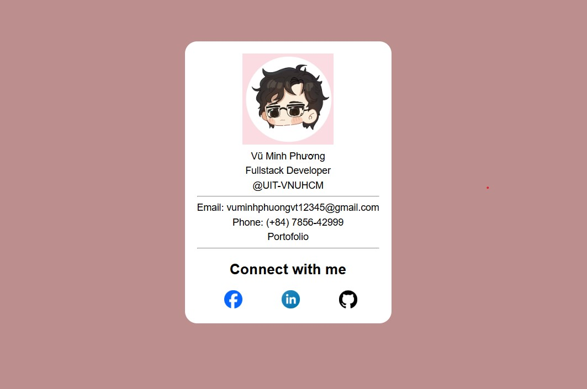

# Web-Clone
- This is a Project created to clone websites that I came across to pursuit web-development

## 1st Webpage: [Minh xin chào](https://minhxinchao.com/optin-page-da-biet-ve-freelance?gad_source=2&gad_campaignid=22335961377&wbraid=ClkKCAjwss3DBhBFEkkAkIzbRKPBL1iTgP_imWoZNl5Jut8PB9sCGb6nu2sLeNlDi-HUACJI0rNpXqg7iyCUlm5FG_0tQG1fWuP-71Oe4btOcLXs6_-VGgInIQ)
- I saw this webpage in an ad and though it was easy to remake so I jumped right into creating this project and cloning the first website.

## 2nd Webpage: [To-do List](./Webpages/To-Do%20List/)
- This is a Lab in my freeCodeCamp Web-development Curriculumn 

|  | 
|:--:| 
| *This is the To-Do List Preview* |

## 3rd Webpage: [Business-Card](./Webpages/Business-Card/)
This is a bussiness card, created from HTML and CSS that I made during the Web-Development course on  freeCodeCamp

|  | 
|:--:| 
| *This is the Business-Card Preview* |
