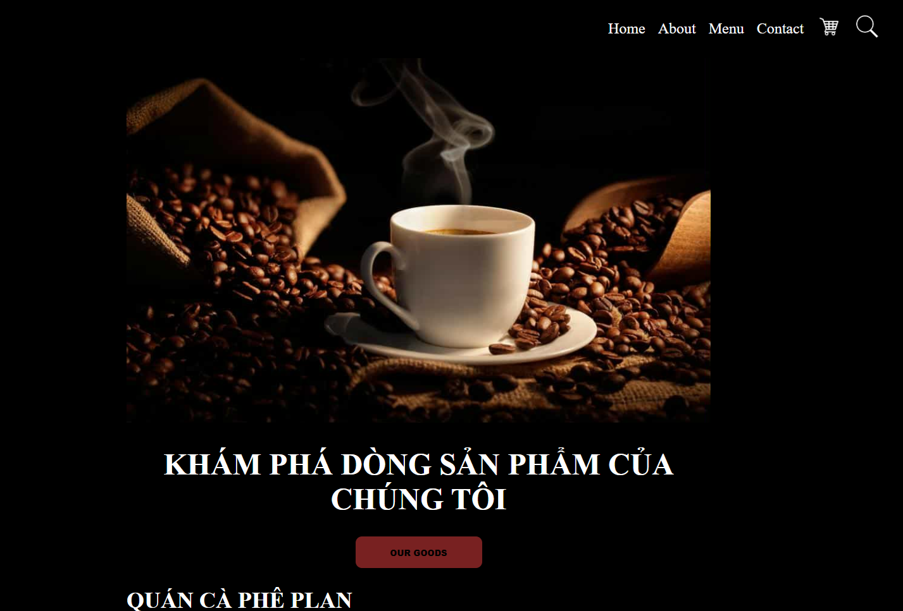

<a href = "https://sunnyyeahboiii.github.io/Web-Clone/">This is the Main Page</a>

# Web-Clone
- This is a Project created to clone websites that I came across to pursuit web-development

## Webpage: [Minh xin chào](./Webpages/Minhxinchao/index.html)
- I saw this webpage in an ad and though it was easy to remake so I jumped right into creating this project and cloning the first website.

- Original Website: [Minh xin chào](https://minhxinchao.com/optin-page-da-biet-ve-freelance?gad_source=2&gad_campaignid=22335961377&wbraid=ClkKCAjwss3DBhBFEkkAkIzbRKPBL1iTgP_imWoZNl5Jut8PB9sCGb6nu2sLeNlDi-HUACJI0rNpXqg7iyCUlm5FG_0tQG1fWuP-71Oe4btOcLXs6_-VGgInIQ)

## Webpage: [Business-Card](./Webpages/Business-Card/)
- This is a bussiness card, created from HTML and CSS that I made during the Web-Development course on  freeCodeCamp

|  | 
|:--:| 

## Webpage: [Sign-in Page](./Webpages/Sign-in%20Page/)

This is a Sign-in Page that is not any functional, just the appearance only.

|  | 
|:--:| 
| *This is the Sign-in Preview* |

## Webpage: [Plan Coffee Advertising Page](./Webpages/PLAN%20coffee/)
My friend asked me for help to code this webpage from a design he sent.

|  | 
|:--:| 

## Webpage: [Contact Form](./Webpages/Form/index.html)

This is contact form a responsive webpage and using Web3Form, it can send form submission to my email.

The webpage design was originally from Front End Mentors.

|  | 
|:--:| 

## Webpage: [Bubble Sort Demonstration](./Webpages/Sorting-Algorithm/index.html)

I created this page during learning Local Storage. Considering functionality, eh, kinda works. But appearance still sucks, gotta work on design skills though.

|  | 
|:--:| 

